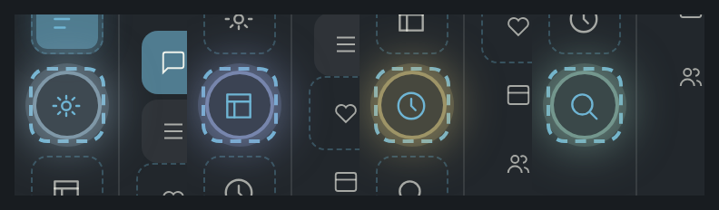
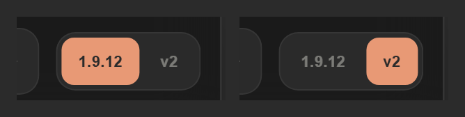
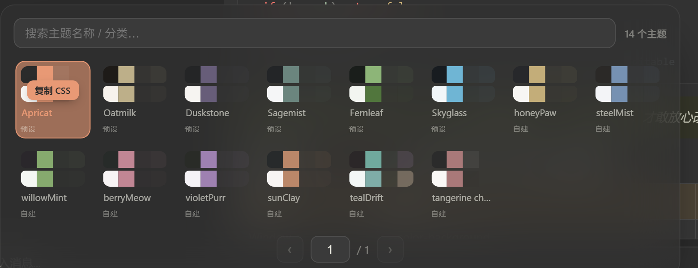
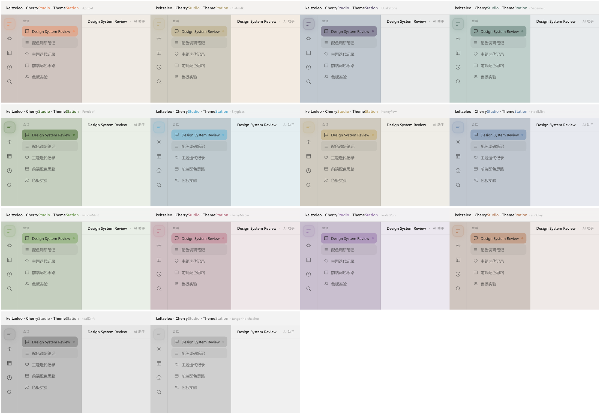

<div align="center">

# Theme Station · V73

**A preview-first theme designer for [Cherry Studio](https://cherry-ai.com).**

No config files, no CSS to hand-write. Click directly on a live interface
preview to recolor every element — chat bubbles, code blocks, tables, the
sidebar — and copy out real, ready-to-paste Cherry Studio CSS.
What you see is **exactly** what gets exported, for **both** Cherry Studio
**v1.9.12** and **v2.0.9**, in light and dark mode at once.

一个面向 [Cherry Studio](https://cherry-ai.com) 的「预览优先」主题编辑器——
不用写配置、不用手改 CSS，在真实界面预览上直接点击调色，所见即所得，
一键复制即可粘贴使用，同时支持 **v1.9.12** 与 **v2.0.9** 两个版本目标，
深色 / 浅色模式一次调好。

[](./LICENSE)
[](https://react.dev)
[](https://vite.dev)
[](#-tests--测试)
[](#-presets--预设)

</div>

---

## 🖼️ Preview · 预览

<p align="center">
  
</p>

<p align="center"><sub>What's on screen above <em>is</em> the export — a live Cherry Studio-shaped preview, a floating color dock, and 14 ready-made presets, all in one window.</sub></p>

---

## ✨ Features · 功能

| Feature · 功能 | Description · 说明 |
| --- | --- |
| 🎯 **Preview-first** · 预览优先 | The whole window *is* a real Cherry Studio interface. Click any element — chat bubble, code block, table, sidebar, topic list, input bar — to open a floating color editor for it. |
| 🌓 **Dark ⇄ Light sync** · 明暗双模式 + 统一修改 | Switch modes instantly. Editing a color in one mode auto-converts and syncs to the other (on by default, per-element override available). |
| 🎨 **Accent-first** · 主色优先 | One accent ball drives the primary color; derived colors (thinking-box text, active states, glows) follow automatically. Structure faces (thinking box / table header / reference / code-name) are derived through a **Morandi-style desaturation** so they stay soft instead of turning into saturated accent clones. |
| 🎯 **Dual export target** · 双版本导出 | Export to **Cherry Studio v1.9.12** (layered `body[theme-mode]`) or **v2.0.9** (Tailwind/shadcn four-layer `:root:root`/`:root.dark`). The in-app copy button emits whichever target is selected — WYSIWYG for both. |
| 🔢 **Precise numeric input** · 精确数值输入 | Every color swatch has R/G/B/alpha number fields right next to it — drag for feel, type for exact values. |
| 📐 **Live WCAG contrast readout** · 实时对比度检测 | A live badge shows the accent-vs-background contrast ratio (`AA` / `大字` / `低`) as you edit, so an unreadable accent gets caught before you export, not after. |
| ↩️ **Undo / Redo** · 撤销 / 重做 | Full history with `⌘Z` / `⌘⇧Z`. |
| 📝 **Floating drafts** · 草稿浮动卡 | Edit a saved preset *in place*, or fork a new theme (auto-named `<name> v2`). Drafts float outside the dock at +10% size to signal "not yet saved". |
| 🧊 **Frosted draggable dock** · 毛玻璃可拖拽 dock | The preset strip is a frosted-glass panel with a drag grip. |
| ♿ **Keyboard accessible** · 键盘无障碍 | Tab-focusable presets with `Space`/`Enter` to select, plus `⌘Z`/`⌘⇧Z` undo/redo — no mouse required. |
| 📤 **Real Cherry Studio export** · 真实导出 | Both targets emit the real runtime variable namespaces, never preview-only names. |

<p align="center">
  
</p>

<p align="center"><sub>The signature detail: every rail icon carries its <strong>own</strong> hover color (<code>--sidebar-glow-1..5</code>), not one shared accent tint — sun, layout, clock and search each light up differently. 每个侧边图标都有自己专属的 hover 发光色，不是同一个 accent 套用五次。</sub></p>

---

## 🎯 Export targets · 导出目标

<p align="center">
  
</p>

<p align="center"><sub>One toggle, both targets — flip it and the copy button emits a completely different CSS shape underneath, with the same preview on screen. 同一个预览，切一下就换导出格式，所见不变、所得不同。</sub></p>

### Cherry Studio v1.9.12 — layered `body[theme-mode]`

- **Layer 1** — every official Cherry Studio variable (118 tokens, in official source order, from the committed `tokenRegistry`).
- **Layer 2** — Theme Station structural extensions (sidebar / table / thinking / syntax / active zones).
- **Shared root** — legacy aliases + the signature sidebar `.sidebar-theme` hover glow.

### Cherry Studio v2.0.9 — Tailwind v4 + shadcn (four-layer surface)

| Layer | Namespace | Purpose |
| --- | --- | --- |
| 1 | `--color-*` | shadcn public contract — emitted for symmetry (not read by the v2 renderer) |
| 2 | `--cs-*` | design-token palette, the source of truth |
| 3 | bare shadcn aliases (`--background` / `--card` / `--primary` / `--border` …) | what the `bg-card` / `text-foreground` / `border-border` utilities actually read |
| 4 | Cherry product semantics (`--background-subtle` / `--link` / `--code-block` / `--reference` / `--highlight` / `--chat-user` / `--resource-list-row-*`) | element-level theming |

The v2 exporter writes **light as `:root:root` and dark as `:root.dark`** — both specificity `(0,2,0)` — so they outrank the app's base `:root`/`.dark` `(0,1,0)` rules **and** the host's inline `--cs-theme-primary*`. The accent is set by emitting bare `--primary`/`--primary-foreground` literals; we never declare the host-owned `--cs-theme-*`.

### v1 ↔ v2 capability matrix · 兼容矩阵

| Capability | v1.9.12 | v2.0.9 |
| --- | --- | --- |
| Background / surface / card / border / text | ✅ | ✅ |
| Primary accent (`--primary`) | ✅ | ✅ (via bare `:root:root`/`:root.dark`) |
| Links · references · highlights | ✅ | ✅ |
| Code-block background · inline-code bg/foreground | ✅ | ✅ |
| Thinking (`part:message-reasoning`) box | ✅ | ✅ |
| Sidebar `.sidebar-theme` glow | ✅ | ✅ |
| Syntax-highlight token colors (keyword / string / comment / number / function / operator) | ✅ (`.hljs-*`) | ❌ **not themable** — v2 renders code through Shiki inline `style`, with no CSS hook, in either surface |
| Sidebar "rainbow" hover (`--sidebar-hover-1..6`) | ✅ | ❌ design-locked in v2 (no `enableRandomSidebarHover`) |
| Session-selected tri-color highlight | ✅ | ⚠️ partially re-addable via structural CSS |

---

## 🎨 Presets · 预设

<p align="center">
  
</p>

<p align="center"><sub>Every preset is a real swatch, not a name in a list — search or scan the grid, click, and the whole preview (and every derived color) updates. 每个预设都是真实色板而不是一行文字，点一下整套预览连带派生色一起换。</sub></p>

### Built-in · 内置预设

| Preset | Accent · 主色 | Harmony scheme · 和声方案 |
| --- | --- | --- |
| `Apricat` | `#E89975` | analogous · 邻近 |
| `Oatmilk` | `#bdaf89` | tetradic · 四元 |
| `Duskstone` | `#675d79` | monochrome · 同色相 |
| `Sagemist` | `#6b857e` | splitComp · 分裂互补 |
| `Fernleaf` | `#22a037` | triadic · 三足 |
| `Skyglass` | `#2c3287` | complementary · 互补 |

### Custom · 自建预设

| Preset | Accent · 主色 | Harmony scheme · 和声方案 |
| --- | --- | --- |
| `honeyPaw` | `#cc9a0f` | complementary · 互补 |
| `steelMist` | `#7691b2` | triadic · 三足 |
| `willowMint` | `#86aa6e` | square · 方阵 |
| `berryMeow` | `#c18694` | splitComp · 分裂互补 |
| `violetPurr` | `#8b4b88` | analogous · 邻近 |
| `sunClay` | `#ba8769` | monochrome · 同色相 |
| `tealDrift` | `#70a99d` | triadic · 三足 |
| `Red Moon` | `#a01818` | analogous · 邻近 |

### Light mode, designed on its own terms · 浅色不是深色的换算题

<p align="center">
  
</p>

<p align="center"><sub>Light mode isn't dark mode with the lightness inverted — each preset's sidebar gets its own mid-tone, confidently-colored chrome (not a pale wash), while the reading area stays genuinely light. All 14 presets, same recipe, all still unmistakably themselves. 浅色不是深色反过来算一遍：每个预设的侧栏都有自己站得住的中间调色彩，而不是一片苍白；内容区依然够亮够安静。十四个预设走的是同一套方法，但看起来各是各的样子。</sub></p>

---

## 🚀 Getting started · 快速开始

Requires Node **20.12+** (`engines`); the test suite is verified on Node **22 LTS**.

```bash
# 1. Install dependencies
npm install

# 2. Start the dev server (opens http://localhost:5173/)
npm run dev
```

> **Node note** · If you ever see `vite: command not found` after install, run `npm install --include=dev` once — an unusual `NODE_ENV=production` environment can skip dev dependencies.

---

## 📜 Scripts · 命令

| Command · 命令 | Description · 说明 |
| --- | --- |
| `npm run dev` | Start dev server · 启动开发服务器 |
| `npm test` | Export-consistency tests (Node built-in runner) · 导出一致性测试 |
| `npm run test:ui` | Interaction / alpha tests (Vitest + jsdom) · 交互与 alpha 测试 |
| `npm run test:all` | Run everything · 运行全部测试 |
| `npm run build` | Production build to `dist/` · 构建 |
| `npm run preview` | Preview the production build · 预览构建产物 |
| `npm run lint` | ESLint · 代码检查 |

`build` uses `vite-plugin-singlefile`, so `dist/index.html` is a self-contained file. The built single-file replica `theme-station-react-single.html` is regenerated from `dist/index.html` (keep it byte-identical).

---

## ✅ Tests · 测试

**69/69 passing** — every edit is regression-checked.

- `test/export-consistency.test.js` + `test/export-v2.test.js` · **49 tests** — locks the invariant that exported CSS values match the preview variables exactly (the Morandi-desaturated harmony surfaces for thinking box / table header / reference / code-name, the accent-tinted assistant/user bubble chips, and the v2.0.9 four-layer `--cs-*`/bare-shadcn surface with boosted specificity).
- `test/ui/*.test.jsx` · **20 tests** — interaction (click-to-edit, undo/redo, draft fork, export-target switching), alpha-channel consistency, and the R/G/B/alpha numeric color inputs.

---

## 🧱 Architecture · 架构

A single source of truth guarantees **what-you-see == what-you-export**:

```
src/
├── theme/
│   ├── tokenRegistry.js   # official v1.9.12 token registry
│   ├── resolver.js        # state → CSS variables (single resolution path)
│   ├── exportCss.js       # layered v1.9.12 Cherry Studio CSS exporter
│   ├── exportV2.js        # v2.0.9 four-layer Tailwind/shadcn exporter
│   ├── themeModel.js      # preview model + bridge to the resolver + target dispatch
│   ├── presets.js         # built-in presets (dark/light plans)
│   ├── zones.js           # element → variable inspector mapping
│   └── defaultTheme.js    # reset target
├── utils/
│   ├── colors.js          # hexA / textTiers / harmonySurface (Morandi desaturation) / alpha helpers
│   └── colorUtils.js      # parseColor / color formatting
├── App.jsx                # the preview-first UI + interactions
├── App.css                # dark/light variable blocks + element styles
└── main.jsx
```

Both exporters resolve from the same `resolver` output, so the preview and the copy button can never diverge per-target.

---

## ⚙️ Tech stack · 技术栈

- [React](https://react.dev) 19
- [Vite](https://vite.dev) 8 + [`vite-plugin-singlefile`](https://www.npmjs.com/package/vite-plugin-singlefile)
- [Vitest](https://vitest.dev) + jsdom for UI tests
- Node built-in test runner (`node --test`) for export-consistency
- ESLint 10 (`flat` config)

---

## 📄 License · 许可

[MIT](./LICENSE) © 2026 Theme Station contributors.

This is a theme-designing tool built for Cherry Studio. Cherry Studio is a trademark of its respective owner; this project is not affiliated with or endorsed by it.

本项目采用 [MIT](./LICENSE) 许可。Cherry Studio 是其所有者的商标，本项目与其无隶属或背书关系。
